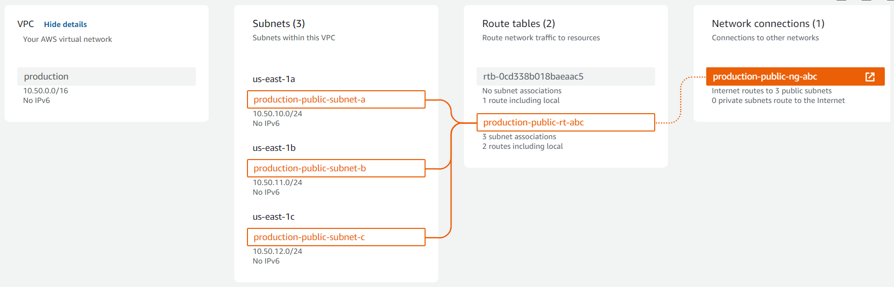
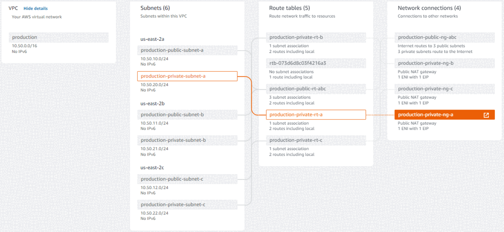

# iac-aws-cce-team

## Description:

This CloudFormation Templete creates and setup the network environment. 

What it is created?

- One VPC
- Three Public subnets
- Three Private subnets
- One InternetGateway and one InternetGateway Attachment
- Three Private NatGateways
- Three Elastic IPs
- One Public Route Table, routes and associations
- Trhee Private Route Tables, routes and associations

### Resource Map

A diagram of public network.




A diagram of private network.


---
## Parameters

This template are parametrized

 - **EnvironmentName:** The environment's name and VPC's name.
    - **Default:** production
 - **OwnerTeam:** Name of the team responsible for maintaining this template and the infrastructure on AWS
    - **Default:** platform
 - **Project:** URL's git project
    - Default: https://github.com/allanmoraes/iac-aws-cce-team/tree/master
 - **VpcCIDR:** VPC's CIDR
    - **Default:** 10.50.0.0/16
 - **PublicSubnet1CIDR:** Public Subnet1's CIDR
    - **Default:** 10.50.10.0/24
 - **PublicSubnet2CIDR:** Public Subnet2's CIDR
    - **Default:** 10.50.11.0/24
 - **PublicSubnet3CIDR:** Public Subnet3's CIDR
    - **Default:** 10.50.12.0/24
 - **PrivateSubnet1CIDR:** Private Subnet1's CIDR
    - **Default:** 10.50.20.0/24
 - **PrivateSubnet2CIDR:** Private Subnet2's CIDR
    - **Default:** 10.50.21.0/24
 - **PrivateSubnet3CIDR:** Private Subnet3's CIDR
    - **Default:** 10.50.22.0/24
---

## How to run
First of all, you have to configure your aws cli, using an user with administrator access.

After, you can create the network executing this command:

```bash
aws cloudformation deploy \
    --stack-name Network \
    --template-file production/network/0_network.yml
```
---

## Outputs

This template has outputs and this outputs can be used by anothe Stack.

 - **VPCId:** A reference to the created VPC
 - **PrimaryCidrBlock:** A reference to the VPC CidrBlock
 - **PublicSubnet1Id:** A reference to the public subnet in the 1st Availability Zone
 - **PublicSubnet1CidrBlock:** A reference to the public subnet CIDR in the 1st Availability Zone
 - **PublicSubnet2Id:** A reference to the public subnet in the 2nd Availability Zone
 - **PublicSubnet2CidrBlock:** A reference to the public subnet CIDR in the 2nd Availability Zone
 - **PublicSubnet3Id:** A reference to the public subnet in the 3rd Availability Zone
 - **PublicSubnet3CidrBlock:** A reference to the public subnet CIDR in the 3rd Availability Zone
 - **PrivateSubnet1Id:** A reference to the private subnet in the 1st Availability Zone
 - **PrivateSubnet1CidrBlock:** A reference to the private subnet CIDR in the 1st Availability Zone
 - **PrivateSubnet2Id:** A reference to the private subnet in the 2nd Availability Zone
 - **PrivateSubnet2CidrBlock:** A reference to the private subnet CIDR in the 2nd Availability Zone
 - **PrivateSubnet3Id:** A reference to the private subnet in the 3rd Availability Zone
 - **PrivateSubnet3CidrBlock:** A reference to the private subnet CIDR in the 3rd Availability Zone

| Key                     | Value                                                                      | Description                                                    | Export name                     |
|-------------------------|----------------------------------------------------------------------------|----------------------------------------------------------------|---------------------------------|
| PrimaryCidrBlock        | 10.50.0.0/16                                                               | A reference to the VPC CidrBlock                               | Network-PrimaryCidrBlock        |
| PrivateSubnet1CidrBlock | 10.50.20.0/24                                                              | -                                                              | Network-PrivateSubnet1CidrBlock |
| PrivateSubnet1Id        | subnet-0b5fcac261bf189aa                                                   | A reference to the private subnet in the 1st Availability Zone | Network-PrivateSubnet1Id        |
| PrivateSubnet2CidrBlock | 10.50.21.0/24                                                              | -                                                              | Network-PrivateSubnet2CidrBlock |
| PrivateSubnet2Id        | subnet-07c105443da5b0a1d                                                   | A reference to the private subnet in the 2nd Availability Zone | Network-PrivateSubnet2Id        |
| PrivateSubnet3CidrBlock | 10.50.22.0/24                                                              | -                                                              | Network-PrivateSubnet3CidrBlock |
| PrivateSubnet3Id        | subnet-0e6dbbfde5def5cd4                                                   | A reference to the private subnet in the 3rd Availability Zone | Network-PrivateSubnet3Id        |
| PublicSubnet1CidrBlock  | 10.50.10.0/24                                                              | -                                                              | Network-PublicSubnet1CidrBlock  |
| PublicSubnet1Id         | subnet-03a6c223334e04f5a                                                   | A reference to the public subnet in the 1st Availability Zone  | Network-PublicSubnet1Id         |
| PublicSubnet2CidrBlock  | 10.50.11.0/24                                                              | -                                                              | Network-PublicSubnet2CidrBlock  |
| PublicSubnet2Id         | subnet-03b8c75d6b001e6f7                                                   | A reference to the public subnet in the 2nd Availability Zone  | Network-PublicSubnet2Id         |
| PublicSubnet3CidrBlock  | 10.50.12.0/24                                                              | -                                                              | Network-PublicSubnet3CidrBlock  |
| PublicSubnet3Id         | subnet-0cf41c0f6fe3b1883                                                   | A reference to the public subnet in the 3rd Availability Zone  | Network-PublicSubnet3Id         |
| VPCId                   | vpc-040776eb945f3e6fc                                                      | A reference to the created VPC                                 | Network-VPCId                   |
